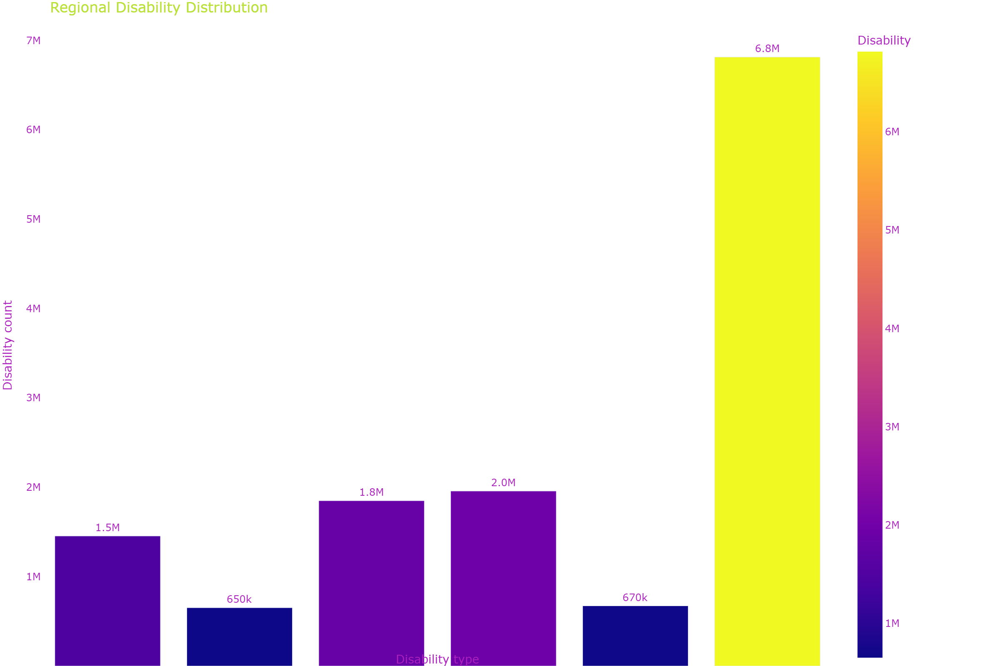
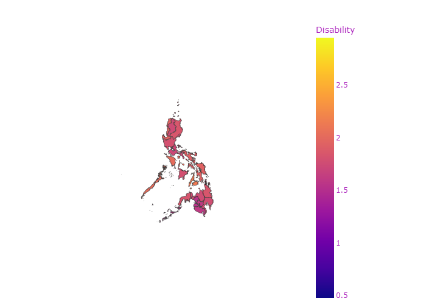
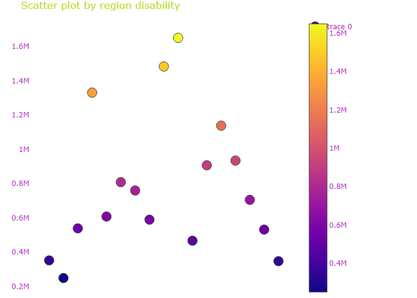
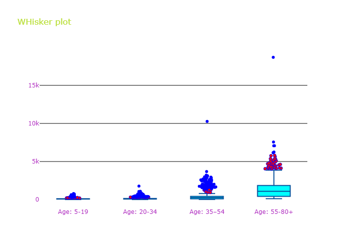

# Functional Difficulty in the Philippines  

A web application providing a visual representation using a choropleth map of the estimated magnitude of poor families in the Philippines from the years 2006, 2009, 2012, and 2015. 
* See live: https://jkianboringot-functional-disability.streamlit.app/
* View process: https://nbviewer.org/github/Jkianboringot/new-functional-disability/blob/main/keep/main.ipynb

### Philippines:Functional Difficulty in the Philippines: Household Population Five Years Old and Over (2020 Census) Statistics Dataset

Base on the Republic Act No. 7277, known as the "Magna Carta for Disabled Persons," was enacted on March 24, 1992. This law aims to promote the rehabilitation, self-development, and integration of persons with disabilities (PWDs) into mainstream society. It ensures equal opportunities and access to education, employment, health services, and social integration for PWDs.

In 2016, Republic Act No. 10754 was enacted to expand the benefits and privileges of PWDs, further reinforcing the government's commitment to their welfare and inclusion.

• Data Source: https://psa.gov.ph/content/functional-difficulty-philippines-household-population-five-years-old-and-over-2020-census  
• Data from: https://data.humdata.org/dataset/philippines-functional-difficulty-census-2020  
• Data from: https://data.humdata.org/dataset/philippines-population-projection-2020-2025-admin3  
• Geojson file from: faeldon/philippines-json-maps 

## Interface preview

<<<<<<< HEAD
=======

>>>>>>> 455ea7cc62795308e43f1d3b32236b5b301e7276
